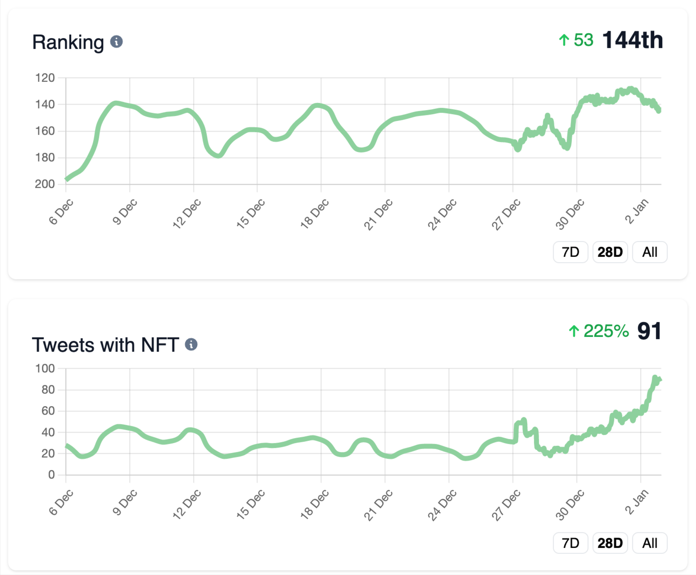
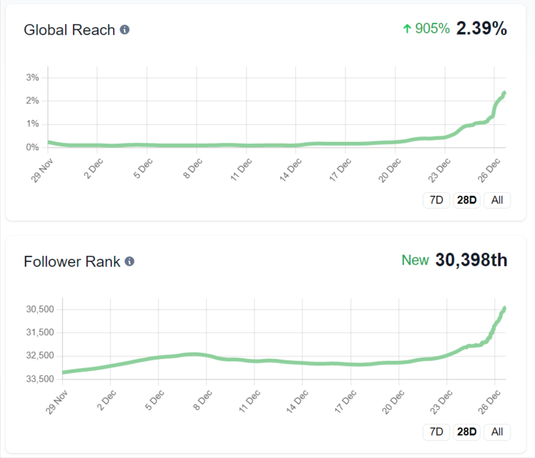
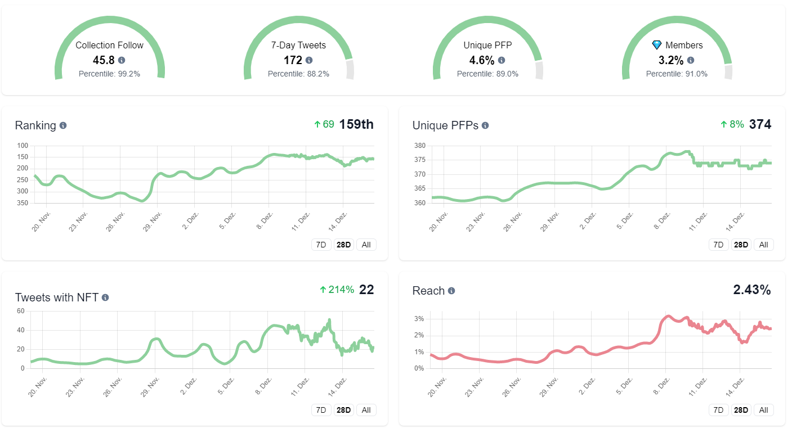
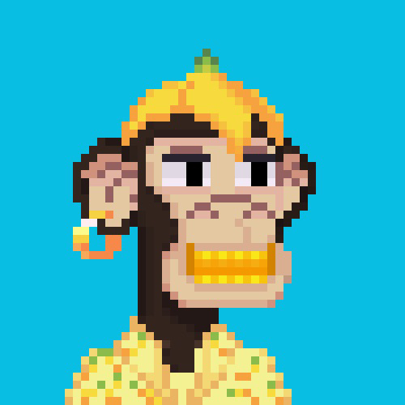

# 🎓 Twitter Academy

## Join Ape Gang's [Discord](https://discord.gg/Gb7yWGnwWT) for personalzed Twitter growth coaching.

> ### What is Ape Gang?
>
> An OG pixel art NFT project with 3 collections - which all interact in the play-and-earn game _Fight Club_. With an ecosystem powered by the $GANG token.
>
> * 10,000 Ape Gang NFTs minted June 2021.
> * 7,800 Toucan Gang NFTs minted October 2021.
> * 5,000 Jaguar Gang NFTs minted April 2022.
>
> Community members use their Ape, Jaguar and Toucan NFTs to fight against one-another in Fight Club. It's a blast, you should definitely check it out!&#x20;
>
> Ape Gang [Website](https://apegang.art/), [Wiki](https://wiki.apegang.art/), [Twitter](https://twitter.com/ApeGangNFT) & [Discord](https://discord.gg/Gb7yWGnwWT)

## Tips for Twitter growth 

After 1.5 years on Twitter we've learnt the best ways to grow! Our Moderator, [KoolKong](https://twitter.com/KoolKongNFT) is sharing those tips you and are proven to help you grow on average 30-60 followers a day.

[Pokermonface](https://twitter.com/pokermonfacenft) has written three fantastic guides too:

* [Basic Twitter Guide](basic-twitter-guide.md)
* [Getting Followers Guide](getting-followers.md)
* [Engagement Farming Guide](engagement-farming.md)

**Ape Academy has guided 12 members to over 5,000 followers already!**

### How to join for personalised coaching: 

1. Own an [Ape Gang NFT](https://opensea.io/collection/ape-gang)
2. Join the [Discord](https://discord.gg/ape-gang-841359732786331658) and verify your NFT
3. Go to the #Ape-Academy channel and follow along!
4. Use an Ape Gang pfp on Twitter too

<figure><figcaption>
See how everyone is progressing
</figcaption></figure>

 

<figure><figcaption>
Analyse your followers
</figcaption></figure>

 

<figure><figcaption>
Grow your Twitter
</figcaption></figure>

 

<figure><figcaption>
Get personalised stats
</figcaption></figure>

Ape Gang [Website](https://apegang.art/), [Wiki](https://wiki.apegang.art/), [Twitter](https://twitter.com/ApeGangNFT) & [Discord](https://discord.gg/Gb7yWGnwWT)

### Written by:

<figure><figcaption>
<a href="https://twitter.com/pokermonfacenft">Pokermonface</a>
</figcaption></figure>

 

<figure><figcaption>
<a href="https://twitter.com/kolsas_eth">Kolsas</a>
</figcaption></figure>

 

<figure><figcaption>
<a href="https://twitter.com/mepusica">Mepusica</a>
</figcaption></figure>

